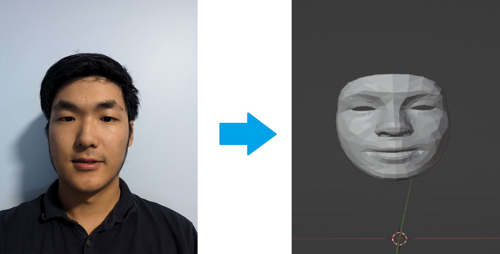

# Face2obj

---
face2obj is a simple Python script that utilizes mediapipe's face_landmarker model and converts the output into an .obj file.



## Installing mediapipe

---

```
python3 -m pip install mediapipe
```

The model is already included in this repo, you can visit
mediapipe's [documentation](https://developers.google.com/mediapipe/solutions/vision/face_landmarker)
to learn more

## Using face2obj

---

1. Move the input image file into `./in/` directory
2. Run `python3 main.py`
3. Enter the file name (`example.jpg`)
4. Output will be located in `./out/output.obj`

---

Made by Shawn Lu, May 2023
